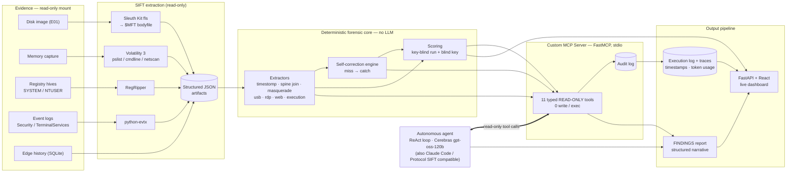

# Architecture

Components: **evidence sources → SIFT extraction → deterministic forensic core → Custom MCP Server
(read-only) → autonomous agent → output pipeline.** The hard logic lives in the deterministic core
and is exposed only through typed, read-only MCP tools (0 write/exec) — so the agent (any model) can
investigate but **cannot modify evidence**.

**How to export as an image for Devpost:** paste this block at <https://mermaid.live>, then
*Actions → Export PNG* (or SVG). GitHub also renders it inline on this page.
